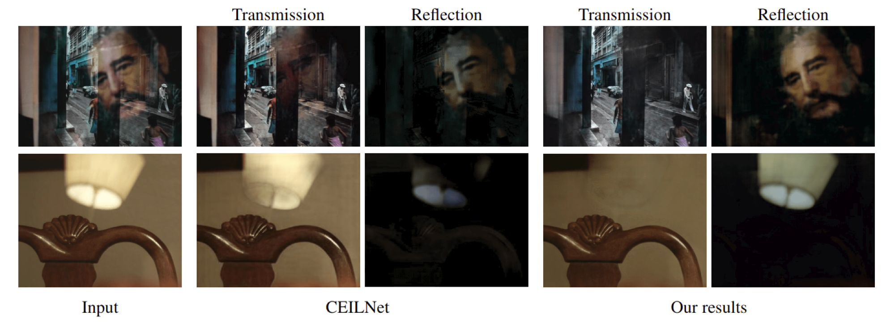

## perceptual-reflection-removal

Code and data for paper [Single Image Reflection Removal with Perceptual Losses](https://arxiv.org/abs/1806.05376)

This code is based on tensorflow. It has been tested on Ubuntu 16.04 LTS.

Part of the code is based upon [FastImageProcessing](https://github.com/CQFIO/FastImageProcessing)

#

# Setup
  * Clone/Download this repo
  * `$ cd perceptual-reflection-removal`
  * `$ mkdir VGG_Model`
  * Download [VGG-19](http://www.vlfeat.org/matconvnet/pretrained/#downloading-the-pre-trained-models). Search imagenet-vgg-verydeep-19 in this page and download imagenet-vgg-verydeep-19.mat. We need the pre-trained VGG-19 model for our hypercolumn input and feature loss
  * move the downloaded vgg model to `VGG_Model`

# Dataset
Both synthetic and real dataset coming soon. 

You can also try with your own dataset. For example, to generate your own synthetic dataset, prepare for two folders of images, one used for transmission layer and the other used for reflection layer. In order to use our data loader, please follow the instructions below to organize your dataset directories. Overall, we name the directory of input image with reflection `blended`, the ground truth transmission layer `transmission_layer` and the ground truth reflection layer `reflection_layer`.

For synthetic data, since we generate images on the fly, there is no need to have the `blended` subdirectory.
>+-- `root_training_synthetic_data` 
>>+-- `reflection_layer` 
>>+-- `transmission_layer` 

For real data, since the ground truth reflection layer is not available, there is no need to have the `reflection_layer` subdirectory.
>+-- `root_training_real_data` 
>>+-- `blended` 
>>+-- `transmission_layer` 

# Training
`python3 main.py`

Change `train_real_root` to the correct synthetic and real dataset paths